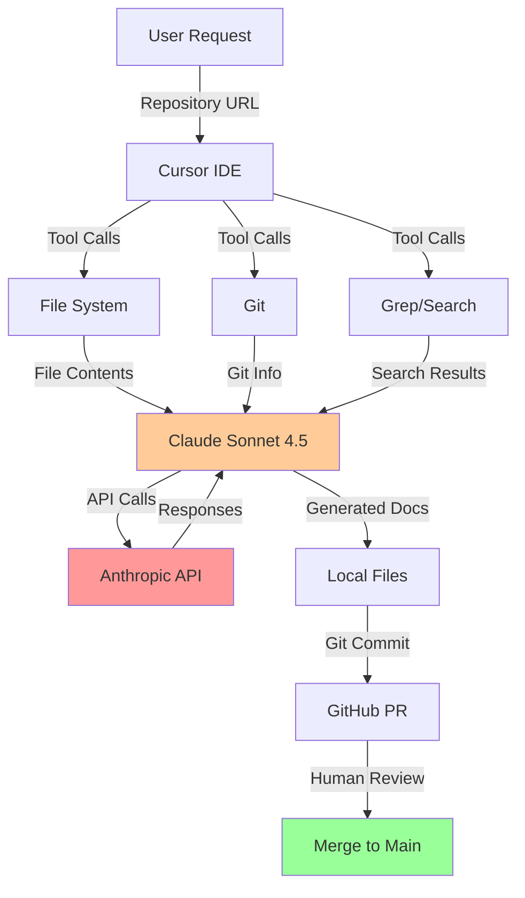

# Agent Doc Creator - Technical Architecture

**Last Updated**: 2024-11-11
**Status**: Documentation of current implementation

> This document explains how Agent Doc Creator actually works under the hood. No marketing, just technical reality.

## Overview

Agent Doc Creator is a **documentation generation tool** that uses AI (Claude via Anthropic) to analyze codebases and generate structured documentation. It's currently implemented as a **manual workflow** executed through Cursor IDE, not an automated CLI tool.

## Current Implementation Reality

### What It Actually Is

- **Platform**: Cursor IDE with Claude Sonnet 4.5 integration
- **Execution**: Manual workflow guided by prompts and tool calls
- **Automation Level**: Semi-automated (human-in-the-loop at each step)
- **Installation**: Not a standalone tool; requires Cursor IDE + MCP browser extension

### What It's Not (Yet)

- ❌ Standalone CLI tool you can `npm install` or `pip install`
- ❌ Fully automated (requires human to approve each step)
- ❌ Self-contained (depends on Cursor IDE environment)
- ❌ Tested on multiple repositories systematically

## Architecture Layers

### 1. Execution Environment

```
Cursor IDE
  └── Claude Sonnet 4.5 (via Anthropic API)
      └── MCP Tools (cursor-browser-extension)
          ├── file_system (read/write files)
          ├── terminal (run commands)
          ├── git (version control)
          └── grep/codebase_search (code analysis)
```

**Key Dependencies**:
- Cursor IDE (proprietary)
- Anthropic API key (external service)
- MCP (Model Context Protocol) tools
- Git (for PR workflow)
- GitHub CLI (`gh`) for PR creation

### 2. Workflow Orchestration

**Current State**: Orchestrated by Claude through conversation, not code.

**Process**:
1. User provides repository URL or path
2. Claude uses tools to:
   - Clone/navigate to repository
   - Read key files (README, package.json, pyproject.toml, etc.)
   - Search codebase for patterns
   - Generate documentation files
   - Commit and create PR

**No Automation**: Each step requires Claude to decide what to do next based on conversation context.

### 3. Repository Scanning

**How It Works**:

```python
# Pseudo-code of what Claude does manually

1. Read entry files:
   - README.md (understand project)
   - package.json / pyproject.toml / go.mod (dependencies)
   - docker-compose.yml (architecture)

2. Search for patterns:
   - grep "class.*Service" (find services)
   - grep "def.*Node" (find LangGraph nodes)
   - grep "router\." (find API routes)
   - codebase_search "How does X work?" (semantic search)

3. Build mental model:
   - Project type (API, agent, pipeline, etc.)
   - Tech stack (Python, Node, Go, etc.)
   - Architecture patterns (layered, microservices, etc.)
   - Key components (services, controllers, models)

4. Generate documentation:
   - Architecture overview (based on mental model)
   - Best practices (based on code patterns)
   - ADRs (inferred from design choices)
   - Configuration (from env vars, config files)
```

**Limitations**:
- **No AST parsing**: Just text search and LLM inference
- **No static analysis**: Can't detect actual dependencies or call graphs
- **Token limits**: Large files (>1000 lines) are truncated
- **Privacy**: Entire files sent to Anthropic API

### 4. AI Integration

**Model**: Claude Sonnet 4.5 (Anthropic)

**API**: Via Cursor IDE (not direct Anthropic SDK)

**Context Window**: 200K tokens (~150K words)

**Token Usage** (estimated for secure_data_retrieval_agent):
```
Repository scan: ~50K tokens input
Documentation generation: ~30K tokens output
Total cost: ~$5-10 per repository (at current Anthropic pricing)
```

**Privacy Concerns**:
- All code sent to external API (Anthropic)
- No local model support
- No data retention controls
- Anthropic's privacy policy applies

### 5. Documentation Generation

**Process**:

```
1. Architecture Overview:
   - Prompt: "Generate architecture overview for [project_type]"
   - Input: README, key files, search results
   - Output: 200-300 line markdown with Mermaid diagram
   - Validation: Line count check

2. Best Practices:
   - Prompt: "Generate best practices for [project_type]"
   - Input: Code patterns, common use cases
   - Output: 250-300 line guide with examples
   - Validation: Line count check

3. ADRs:
   - Prompt: "Identify major architectural decisions"
   - Input: Architecture patterns, tech choices
   - Output: 2-3 ADRs (200-250 lines each)
   - Validation: Line count check

4. Configuration Reference:
   - Prompt: "Document all configuration options"
   - Input: Env vars, config files, metadata
   - Output: 250-300 line reference
   - Validation: Line count check
```

**Quality Control**:
- ✅ Line counting (enforced)
- ✅ Structure validation (headings, tables)
- ❌ Broken link detection (not implemented)
- ❌ Code syntax checking (not implemented)
- ❌ Readability scoring (not implemented)

### 6. Git Workflow

**Process**:

```bash
# What Claude actually does

1. Create branch:
   git checkout -b ai/docs-comprehensive-$(date +%Y%m%d)

2. Generate docs:
   # (multiple write operations)

3. Commit:
   git add docs/
   git commit -m "docs: Add comprehensive documentation"

4. Push:
   git push origin ai/docs-comprehensive-$(date +%Y%m%d)

5. Create PR:
   gh pr create --title "..." --body "..."
```

**Human Review**: Required before merge (PR workflow).

## Data Flow



**Privacy Implications**:
- 🔴 **Red**: External API (code leaves your infrastructure)
- 🟡 **Orange**: AI processing (in Cursor IDE memory)
- 🟢 **Green**: Human review (you control merge)

## Performance

### Measured (secure_data_retrieval_agent)

| Phase | Time | Token Usage |
|-------|------|-------------|
| Repository scan | ~2 minutes | ~50K input |
| Architecture generation | ~3 minutes | ~10K output |
| Best practices generation | ~3 minutes | ~10K output |
| ADR generation (2x) | ~4 minutes | ~8K output |
| Configuration generation | ~2 minutes | ~6K output |
| **Total** | **~15 minutes** | **~84K tokens** |

**Cost**: ~$8 (at $3/M input, $15/M output tokens)

### Projected (untested)

| Repository Size | Time | Cost |
|-----------------|------|------|
| Small (<10K LOC) | 10-15 min | $5-10 |
| Medium (10-50K LOC) | 15-30 min | $10-20 |
| Large (50-100K LOC) | 30-60 min | $20-40 |
| Very Large (>100K LOC) | Unknown | Unknown |

**Bottlenecks**:
- LLM API latency (2-5 seconds per call)
- Context window limits (200K tokens)
- Human approval for each tool call

## Limitations & Constraints

### Technical Limitations

1. **No AST Parsing**
   - Can't detect actual code structure
   - Relies on text search and LLM inference
   - May miss complex relationships

2. **No Static Analysis**
   - Can't trace actual dependencies
   - Can't detect dead code
   - Can't verify code correctness

3. **Token Limits**
   - 200K token context window
   - Large files truncated
   - May miss important details in large repos

4. **No Incremental Updates**
   - Regenerates all docs from scratch
   - Will overwrite human edits
   - No diff-based updates

### Privacy Limitations

1. **External API**
   - All code sent to Anthropic
   - No local model support
   - Subject to Anthropic's privacy policy

2. **No Data Controls**
   - Can't prevent sensitive code from being sent
   - No redaction or filtering
   - No audit trail of what was sent

### Validation Limitations

1. **Only Line Counting**
   - No broken link detection
   - No code syntax checking
   - No readability scoring

2. **No Automated Testing**
   - Code examples not tested
   - Commands not verified
   - Links not validated

## Comparison to Alternatives

| Feature | Agent Doc Creator | Mintlify | Docusaurus | Readme.com |
|---------|-------------------|----------|------------|------------|
| **Automation** | Semi-automated | Fully automated | Manual | Semi-automated |
| **AI-Powered** | ✅ Claude | ✅ GPT-4 | ❌ | ✅ GPT-3.5 |
| **Installation** | Cursor IDE | CLI | CLI | Web app |
| **Privacy** | External API | External API | Local | External API |
| **Cost** | $5-10/repo | $120/mo | Free | $99/mo |
| **Edit Preservation** | ❌ | ✅ | ✅ | ✅ |
| **Customization** | Prompts | Config | Full control | Limited |
| **Quality Control** | Line counting | AI review | Manual | AI review |

**Verdict**: Agent Doc Creator is less mature than alternatives but offers more control over output structure.

## Future Architecture (Planned)

### Phase 1: Standalone CLI

```bash
npm install -g agent-doc-creator
agent-doc-creator --repo /path/to/repo --output docs/
```

**Requirements**:
- Node.js or Python CLI
- Direct Anthropic SDK integration
- Local file system access
- Git integration

### Phase 2: Local Model Support

```bash
agent-doc-creator --model ollama/llama3 --repo /path/to/repo
```

**Requirements**:
- Ollama integration
- llama.cpp support
- Prompt optimization for smaller models

### Phase 3: Incremental Updates

```bash
agent-doc-creator --update --preserve-edits
```

**Requirements**:
- Git diff analysis
- Frontmatter metadata (last updated, AI-generated flag)
- Merge conflict resolution

### Phase 4: Real Validation

```bash
agent-doc-creator --validate
```

**Requirements**:
- Broken link checker (crawl all links)
- Code syntax validator (run through linters)
- Readability scorer (Flesch score)
- Example tester (actually run code)

## Security Considerations

### Current Risks

1. **Code Exfiltration**
   - All code sent to Anthropic API
   - No redaction or filtering
   - Potential for sensitive data leakage

2. **Credential Exposure**
   - If code contains hardcoded credentials, they're sent to API
   - No secret detection

3. **Dependency Vulnerabilities**
   - No scanning of dependencies
   - Generated docs may reference vulnerable packages

### Mitigations (Planned)

1. **Local Model Support**
   - Run entirely offline with Ollama
   - No external API calls

2. **Secret Detection**
   - Scan files before sending to API
   - Redact API keys, passwords, tokens

3. **Allowlist Mode**
   - Only send specified files to API
   - Exclude sensitive directories (e.g., `.env`, `secrets/`)

## Development Roadmap

| Phase | Status | Target |
|-------|--------|--------|
| **Current**: Manual workflow in Cursor | ✅ Done | - |
| **Phase 1**: Standalone CLI | ❌ Not started | Q2 2025 |
| **Phase 2**: Local model support | ❌ Not started | Q3 2025 |
| **Phase 3**: Incremental updates | ❌ Not started | Q4 2025 |
| **Phase 4**: Real validation | ❌ Not started | Q1 2026 |

## References

- [Cursor IDE](https://cursor.sh/)
- [Anthropic API](https://www.anthropic.com/api)
- [Model Context Protocol (MCP)](https://modelcontextprotocol.io/)
- [secure_data_retrieval_agent PR #3](https://github.com/securedotcom/secure_data_retrieval_agent/pull/3) - Example output

