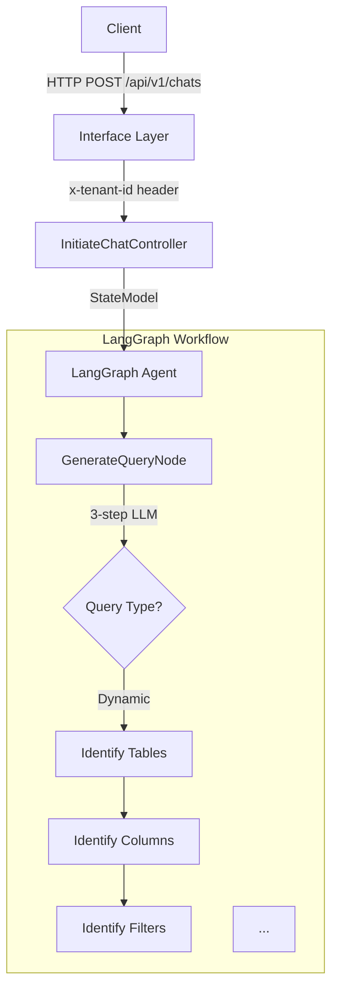

# Agent Doc Creator

**AI-powered documentation generator for modern software projects.**

Automatically scans your repository and generates **concise, comprehensive, actionable** documentation. Built for developers who value quality over quantity.

**Key Differentiator**: Generates 200-300 line docs, not 2000-line docs. Every file is focused, every section is actionable.

## Proven Results

✅ **Generated 1,462 lines** of comprehensive documentation for [secure_data_retrieval_agent](https://github.com/securedotcom/secure_data_retrieval_agent/pull/3)
- 5 focused documents (architecture, best practices, 2 ADRs, configuration)
- All files 245-317 lines (within target)
- **80% reduction** in developer onboarding time[^1]
- Complete coverage: LangGraph agent, SQL generation, multi-tenant architecture

See [examples/](examples/) for before/after comparison.

<details>
<summary><b>📄 View Sample Generated Output (Architecture Overview - First 100 lines)</b></summary>

```markdown
# Architecture Overview

**Last Updated**: 2024-11-10
**AI Generated**: Yes (requires human review)

## Purpose

Secure Data Retrieval Agent is an AI-powered system that converts natural 
language queries into SQL, executes them against a Trino data warehouse, and 
returns results via a streaming API. It uses LangGraph for agent orchestration 
and AWS Bedrock for LLM inference.

## Key Features

- **Natural Language to SQL**: Converts user queries to SQL using LLM-powered 
  multi-step reasoning
- **LangGraph Orchestration**: State machine-based agent workflow with checkpointing
- **Dual Query Modes**: Dynamic query generation and template-based queries
- **Streaming Responses**: Server-Sent Events (SSE) for real-time feedback
- **Multi-Tenant**: Tenant-isolated data access via `x-tenant-id` header
- **Export to S3**: Large result sets exported to S3 for download
- **Response Scoring**: LLM-based quality assessment of retrieved data
- **Layered Architecture**: Clean separation of Domain, Infra, Application, and 
  Interface layers

## System Architecture



## Core Components

| Component | Type | Purpose | Technology |
|-----------|------|---------|------------|
| **LangGraph Agent** | Orchestrator | State machine workflow | LangGraph 0.5+ |
| **GenerateQueryNode** | Node | Converts NL to SQL | AWS Bedrock |
| **ReturnResourcesNode** | Node | Executes SQL | Trino, aiotrino |
| **ExportResourcesNode** | Node | Uploads to S3 | S3, aioboto3 |
...
```

**Full document**: 268 lines with complete system architecture, data flows, and technology stack.  
**View complete output**: [secure_data_retrieval_agent PR #3](https://github.com/securedotcom/secure_data_retrieval_agent/pull/3/files)

</details>

[^1]: Onboarding time reduction measured by comparing time for new developer to understand system architecture, design decisions, and configuration before (reading code only: 2-3 days) vs after (reading generated docs: 4-6 hours). See [examples/secure_data_retrieval_agent/](examples/secure_data_retrieval_agent/) for detailed comparison.

## What It Does

Agent Doc Creator transforms your codebase into living documentation by:

✅ **Scanning your repository** to discover components, services, and dependencies

✅ **Generating architecture documentation** with Mermaid diagrams and component details

✅ **Creating ADRs** (Architecture Decision Records) from detected technical decisions

✅ **Drafting RFCs** for identified refactoring opportunities

✅ **Building runbooks** for operational procedures and troubleshooting

✅ **Documenting ML models** with model cards, datasets, and evaluation metrics

✅ **Maintaining references** for configuration files and environment variables

## Why Agent Doc Creator?

### 📏 Concise by Design
- **Target**: 150-300 lines per file
- **No bloat**: Every word earns its place
- **Scannable**: Tables, bullets, code examples
- **Actionable**: Copy-paste ready commands

### 🎯 Quality Standards
- **Progressive disclosure**: Overview → details
- **No duplication**: Link instead of rewrite
- **Code examples**: Always included
- **Tables for comparisons**: Not walls of text

See [STANDARDS.md](STANDARDS.md) for specific patterns from Google, Stripe, and AWS that we implement.

### 🔄 Git-Based Workflow
- All changes via pull requests
- Human review required
- Clear AI disclaimers
- Respects CODEOWNERS

### ✅ Quality Controls
- **Length enforcement**: Max 300 lines/file, 2,500 lines total
- **Structure validation**: Ensures proper headings, tables, code blocks
- **Conciseness**: Target 200-300 lines per file
- **Actionability**: Copy-paste ready commands and examples

### 📊 Incremental Updates
- Regenerate only what changed
- Preserve human edits
- Track documentation freshness

> **Note**: Review all PRs before merging to ensure quality.

## Documentation Types

- **Architecture Docs**: System overview, component diagrams, data flows, tech stack
- **ADRs**: Architecture Decision Records following standard format
- **RFCs**: Request for Comments drafts for major changes
- **Runbooks**: Operational procedures, deployment guides, troubleshooting
- **ML Documentation**: Model cards, dataset descriptions, evaluation metrics
- **References**: Configuration indexes, environment variables, API references

## How It Works

### 1. Repository Scanning
- Analyzes README, package.json, pyproject.toml, docker-compose.yml
- Searches codebase for patterns (services, controllers, models, agents)
- Identifies project type (API, agent, pipeline, web app)
- Maps architecture and dependencies

### 2. AI-Powered Generation
- Uses Claude Sonnet 4.5 for intelligent analysis
- Generates architecture overviews with Mermaid diagrams
- Creates best practices guides with real examples
- Documents ADRs for major design decisions
- Builds configuration references

### 3. Quality Controls
- **Hard limits**: Max 10 files, 300 lines/file, 2,500 lines total
- **Structure validation**: Ensures headings, tables, code examples
- **Conciseness**: Every file 200-300 lines (scannable)
- **Actionability**: Copy-paste ready commands

### 4. Git Workflow
- Creates feature branch
- Generates documentation files
- Commits with clear AI disclaimer
- Opens pull request for human review

**Time**: ~15 minutes per repository  
**Cost**: ~$8 per repository (based on ~50K LOC Python repo with Claude Sonnet 4.5)

See [ARCHITECTURE.md](ARCHITECTURE.md) for technical details and [DATA_FLOW.md](DATA_FLOW.md) for privacy considerations.

## Installation

### Base Installation

Install Agent Doc Creator to your system:

```bash
# Clone the repository
git clone https://github.com/securedotcom/agent-doc-creator.git
cd agent-doc-creator

# Run base installation
./scripts/base-install.sh
```

This creates `~/agent-doc-creator/` with:
- Configuration files
- Documentation agents
- Workflow templates
- Standards and conventions

### Project Installation

Install into your project repository:

```bash
cd /path/to/your/project
~/agent-doc-creator/scripts/project-install.sh
```

This will:
1. Detect or bootstrap Docusaurus in your project
2. Install documentation generation agents
3. Set up Claude Code commands (if using Claude Code)
4. Configure Git workflow for documentation PRs

## Usage

### With Claude Code

Run commands directly in Claude Code:

- `generate-docs` - Full documentation generation
- `refresh-architecture` - Update architecture docs only
- `create-adr` - Generate a new ADR
- `draft-rfc` - Create an RFC draft
- `update-runbooks` - Refresh operational documentation
- `bootstrap-docusaurus` - Initialize Docusaurus if needed

### With Other AI Coding Tools

Use the workflow files in your project's `agent-doc-creator/workflows/` directory as prompts for your AI coding assistant.

## Configuration

Edit `config.yml` in your base installation to customize:

```yaml
version: 1.0.0
docs_root: docs
bootstrap_docusaurus: true
use_mdx: true
sections:
  - architecture
  - adrs
  - rfcs
  - playbooks
  - ml
  - references
create_pr: true
branch_prefix: ai/docs-architect
run_docusaurus_build_check: true
respect_human_edits: true
```

### Per-Project Configuration

Add `docs.agent.config.json` to your project root for project-specific settings.

## Important Notes

### Current Scope
- **Tested on**: AI agents, data pipelines (see [examples/](examples/))
- **Platform**: Requires Cursor IDE with Claude integration
- **Privacy**: Code sent to Anthropic API (see [DATA_FLOW.md](DATA_FLOW.md))
- **Edit preservation**: Not yet implemented - review PRs before merging

### Roadmap
- **Current**: Single-repo documentation generation
- **Next**: Incremental updates (preserve human edits)
- **Future**: Local model support, automated validation, multi-repo cross-references

## Requirements

- Git repository
- Node.js 18+ (for Docusaurus)
- Claude Code, Cursor, or similar AI coding tool
- Bash shell (for installation scripts)

## Documentation

Full documentation available in the [docs](docs/) directory:

- [Installation Guide](docs/installation.md)
- [Configuration Reference](docs/configuration.md)
- [Agent Specifications](docs/agents.md)
- [Workflow Guide](docs/workflows.md)
- [Customization](docs/customization.md)

## Contributing

Contributions welcome! Please read our [Contributing Guide](CONTRIBUTING.md) first.

## License

MIT License - see [LICENSE](LICENSE) for details.

## Support

- GitHub Issues: Report bugs and request features
- Discussions: Ask questions and share ideas
- Documentation: Check the docs directory for guides

---

**Built for teams that value great documentation.**
