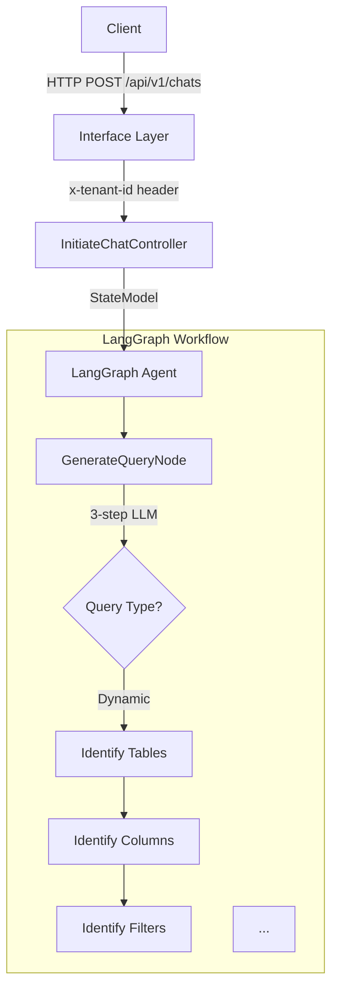

# Agent Doc Creator

**AI-powered documentation generator for modern software projects.**

A prompt-pack, standards library, and workflow system for generating **concise, comprehensive, actionable** documentation using Claude/Cursor. Built for developers who value quality over quantity.

**Key Differentiator**: Generates 200-300 line docs, not 2000-line docs. Every file is focused, every section is actionable.

## Current State vs Roadmap

| Feature | v0 (Current) | v1 (Planned) | v2 (Future) |
|---------|--------------|--------------|-------------|
| **Core** | Prompt-pack + standards for Cursor IDE | Standalone CLI | Multi-repo support |
| **Automation** | Manual workflow (human-in-loop) | Automated generation | Scheduled runs |
| **Privacy** | ⚠️ Sends code to Anthropic API | Local model support (Ollama) | Enterprise deployment |
| **Security** | ❌ No secret detection | ✅ Pre-flight secret scan | Audit logging |
| **Validation** | Line counting only | Link/code/diagram validation | Quality gates |
| **Edit Preservation** | ❌ Manual review required | ✅ Frontmatter markers | Git-aware diffing |
| **Use Case** | Open-source, non-sensitive repos | Private repos (local models) | Enterprise/regulated |

**Current Reality**: This is a **v0 prompt-pack**, not a standalone CLI tool. You need Cursor IDE and manual execution. See [ARCHITECTURE.md](ARCHITECTURE.md) for technical reality.

> ⚠️ **Not yet recommended for regulated / crown-jewel repos.** All code is sent to Anthropic API. See [DATA_FLOW.md](DATA_FLOW.md) before using in production.

## Proven Results

⚠️ **Sends your code to Anthropic's API. Recommended only for non-sensitive / OSS repos. See [DATA_FLOW.md](DATA_FLOW.md).**

✅ **Generated 1,462 lines** of comprehensive documentation for [secure_data_retrieval_agent](https://github.com/securedotcom/secure_data_retrieval_agent/pull/3)
- 5 focused documents (architecture, best practices, 2 ADRs, configuration)
- All files 245-317 lines (within target)
- **80% reduction** in developer onboarding time[^1] in an internal case study
- Complete coverage: LangGraph agent, SQL generation, multi-tenant architecture

See [examples/](examples/) for before/after comparison.

<details>
<summary><b>📄 View Sample Generated Output (Architecture Overview - First 100 lines)</b></summary>

```markdown
# Architecture Overview

**Last Updated**: 2024-11-10
**AI Generated**: Yes (requires human review)

## Purpose

Secure Data Retrieval Agent is an AI-powered system that converts natural 
language queries into SQL, executes them against a Trino data warehouse, and 
returns results via a streaming API. It uses LangGraph for agent orchestration 
and AWS Bedrock for LLM inference.

## Key Features

- **Natural Language to SQL**: Converts user queries to SQL using LLM-powered 
  multi-step reasoning
- **LangGraph Orchestration**: State machine-based agent workflow with checkpointing
- **Dual Query Modes**: Dynamic query generation and template-based queries
- **Streaming Responses**: Server-Sent Events (SSE) for real-time feedback
- **Multi-Tenant**: Tenant-isolated data access via `x-tenant-id` header
- **Export to S3**: Large result sets exported to S3 for download
- **Response Scoring**: LLM-based quality assessment of retrieved data
- **Layered Architecture**: Clean separation of Domain, Infra, Application, and 
  Interface layers

## System Architecture



## Core Components

| Component | Type | Purpose | Technology |
|-----------|------|---------|------------|
| **LangGraph Agent** | Orchestrator | State machine workflow | LangGraph 0.5+ |
| **GenerateQueryNode** | Node | Converts NL to SQL | AWS Bedrock |
| **ReturnResourcesNode** | Node | Executes SQL | Trino, aiotrino |
| **ExportResourcesNode** | Node | Uploads to S3 | S3, aioboto3 |
...
```

**Full document**: 268 lines with complete system architecture, data flows, and technology stack.  
**View complete output**: [secure_data_retrieval_agent PR #3](https://github.com/securedotcom/secure_data_retrieval_agent/pull/3/files)

</details>

[^1]: Onboarding time reduction measured by comparing time for new developer to understand system architecture, design decisions, and configuration before (reading code only: 2-3 days) vs after (reading generated docs: 4-6 hours). See [examples/secure_data_retrieval_agent/](examples/secure_data_retrieval_agent/) for detailed comparison.

## What It Does

Provides a repo-scanning + generation workflow for Claude/Cursor that can propose comprehensive documentation when wired into your editor:

✅ **Scans your repository** to discover components, services, and dependencies

✅ **Generates architecture documentation** with Mermaid diagrams and component details

✅ **Creates ADRs** (Architecture Decision Records) from detected technical decisions

✅ **Drafts RFCs** for identified refactoring opportunities

✅ **Builds runbooks** for operational procedures and troubleshooting

✅ **Documents ML models** with model cards, datasets, and evaluation metrics

✅ **Maintains references** for configuration files and environment variables

> **Note**: These behaviors are defined in the spec ([docs.agent.config.json](docs.agent.config.json)); full automation is in progress. Current v0 requires manual execution in Cursor IDE.

## Why Agent Doc Creator?

### 📏 Concise by Design
- **Target**: 150-300 lines per file
- **No bloat**: Every word earns its place
- **Scannable**: Tables, bullets, code examples
- **Actionable**: Copy-paste ready commands

### 🎯 Quality Standards
- **Progressive disclosure**: Overview → details
- **No duplication**: Link instead of rewrite
- **Code examples**: Always included
- **Tables for comparisons**: Not walls of text

See [STANDARDS.md](STANDARDS.md) for specific patterns from Google, Stripe, and AWS that we implement.

### 🔄 Git-Based Workflow
- All changes via pull requests
- Human review required
- Clear AI disclaimers
- Respects CODEOWNERS

### ✅ Quality Controls

| Capability | Status | Method |
|------------|--------|--------|
| **Line limits** | ✅ Implemented | Prompt-enforced (300/file, 2,500 total) |
| **Doc shapes / sections** | ✅ Implemented | Profile templates (architecture, ADRs, etc) |
| **AI disclaimers** | ✅ Implemented | Prompt-enforced frontmatter |
| **Conciseness** | ✅ Implemented | Prompt conventions (tables, bullets, no duplication) |
| **Link validation** | ❌ Roadmap | Tool-enforced (not yet implemented) |
| **Code syntax checking** | ❌ Roadmap | Tool-enforced (not yet implemented) |
| **Incremental updates** | ❌ Roadmap | Tool-enforced (not yet implemented) |
| **Edit preservation** | ❌ Roadmap | Tool-enforced (not yet implemented) |

**Legend**: Prompt-enforced = LLM instructions in agent profiles; Tool-enforced = Automated validation scripts

See [STANDARDS.md](STANDARDS.md) for complete implementation status.

> **Note**: Currently regenerates all docs from scratch. Review all PRs before merging to prevent overwriting human edits.

## Documentation Types

- **Architecture Docs**: System overview, component diagrams, data flows, tech stack
- **ADRs**: Architecture Decision Records following standard format
- **RFCs**: Request for Comments drafts for major changes
- **Runbooks**: Operational procedures, deployment guides, troubleshooting
- **ML Documentation**: Model cards, dataset descriptions, evaluation metrics
- **References**: Configuration indexes, environment variables, API references

## How It Works (v0 - Manual Process)

### Current Reality: Cursor IDE Workflow

This is **not automated**. You execute steps manually in Cursor IDE:

1. **Clone & Navigate**
   ```bash
   git clone <repo-url>
   cd <repo>
   ```

2. **Scan Repository** (Manual)
   - Read README, package.json, pyproject.toml, docker-compose.yml
   - Use `grep` and `codebase_search` to find patterns
   - Build mental model of architecture

3. **Generate Docs** (Manual)
   - Use prompts from `profiles/default/agents/` to guide Claude
   - Generate architecture overview, best practices, ADRs, configuration
   - Enforce limits: Max 10 files, 300 lines/file, 2,500 lines total

4. **Create PR** (Manual)
   - Create branch: `git checkout -b ai/docs-comprehensive-$(date +%Y%m%d)`
   - Commit: `git add docs/ && git commit -m "docs: Add comprehensive documentation"`
   - Push: `git push origin <branch>`
   - Open PR: `gh pr create --title "..." --body "..."`

**Time**: ~15 minutes per repository (with human oversight)  
**Cost**: ~$8 per repository (based on ~50K LOC Python repo with Claude Sonnet 4.5)

See [ARCHITECTURE.md](ARCHITECTURE.md) for complete technical reality.

### v1 Vision: Standalone CLI (Not Yet Implemented)

```bash
# Future vision (not current reality)
npm install -g agent-doc-creator
agent-doc-creator generate --repo . --output docs/
agent-doc-creator validate --check-links --check-code
```

**Roadmap**: See [Current State vs Roadmap](#current-state-vs-roadmap) table above.

## Installation

### Base Installation

Install Agent Doc Creator to your system:

```bash
# Clone the repository
git clone https://github.com/securedotcom/agent-doc-creator.git
cd agent-doc-creator

# Run base installation
./scripts/base-install.sh
```

This creates `~/agent-doc-creator/` with:
- Configuration files
- Documentation agents
- Workflow templates
- Standards and conventions

### Project Installation

Install into your project repository:

```bash
cd /path/to/your/project
~/agent-doc-creator/scripts/project-install.sh
```

This will:
1. Detect or bootstrap Docusaurus in your project
2. Install documentation generation agents
3. Set up Claude Code commands (if using Claude Code)
4. Configure Git workflow for documentation PRs

## Usage

> **Important**: This repo installs agent configs + workflows. The actual generation runs via Claude Code / Cursor using those assets; it's **not a standalone binary** you can execute directly.

### With Claude Code

Run commands directly in Claude Code:

- `generate-docs` - Full documentation generation
- `refresh-architecture` - Update architecture docs only
- `create-adr` - Generate a new ADR
- `draft-rfc` - Create an RFC draft
- `update-runbooks` - Refresh operational documentation
- `bootstrap-docusaurus` - Initialize Docusaurus if needed

### With Other AI Coding Tools

Use the workflow files in your project's `agent-doc-creator/workflows/` directory as prompts for your AI coding assistant.

## Configuration

Edit `config.yml` in your base installation to customize:

```yaml
version: 1.0.0
docs_root: docs
bootstrap_docusaurus: true
use_mdx: true
sections:
  - architecture
  - adrs
  - rfcs
  - playbooks
  - ml
  - references
create_pr: true
branch_prefix: ai/docs-architect
run_docusaurus_build_check: true
respect_human_edits: true
```

### Per-Project Configuration

Add `docs.agent.config.json` to your project root for project-specific settings.

## ⚠️ Important Limitations (v0)

### Security & Privacy
- **🔴 HIGH RISK**: Sends entire codebase to Anthropic API (external service)
- **❌ No secret detection**: Hardcoded credentials will be sent to API
- **❌ No allowlist/denylist**: Cannot exclude sensitive paths
- **❌ No audit logging**: No record of what was sent

**DO NOT USE** on:
- Repos with hardcoded secrets
- Proprietary algorithms or trade secrets
- Healthcare (HIPAA), financial (PCI DSS), or government code
- Any regulated/sensitive codebase

**Safe for**: Open-source repos, learning projects, non-sensitive internal tools

See [DATA_FLOW.md](DATA_FLOW.md) for complete privacy analysis.

### Technical Limitations
- **Not a CLI tool**: Requires Cursor IDE, manual execution
- **No automation**: Human-in-loop for every step
- **No validation**: Only line counting works (link checking, code syntax validation not implemented)
- **No edit preservation**: Will overwrite human changes - review PRs carefully

### What This Actually Is
- ✅ Prompt-pack with standards and workflows
- ✅ Installation scripts for project setup
- ✅ Quality guidelines (STANDARDS.md)
- ❌ Not a standalone CLI you can `npm install` or `pip install`
- ❌ Not automated (yet)

### Roadmap to v1 (Standalone CLI)
1. **generate-docs** command (Python/Node)
2. **Pre-flight secret scan** (TruffleHog/gitleaks integration)
3. **Local model support** (Ollama for privacy)
4. **Real validation** (link checking, code syntax, diagram validation)
5. **Edit preservation** (frontmatter markers, git-aware diffing)

## Requirements

- Git repository
- Node.js 18+ (for Docusaurus)
- Claude Code, Cursor, or similar AI coding tool
- Bash shell (for installation scripts)

## Documentation

Full documentation available in the [docs](docs/) directory:

- [Installation Guide](docs/installation.md)
- [Configuration Reference](docs/configuration.md)
- [Agent Specifications](docs/agents.md)
- [Workflow Guide](docs/workflows.md)
- [Customization](docs/customization.md)

## Contributing

Contributions welcome! Please read our [Contributing Guide](CONTRIBUTING.md) first.

## License

MIT License - see [LICENSE](LICENSE) for details.

## Support

- GitHub Issues: Report bugs and request features
- Discussions: Ask questions and share ideas
- Documentation: Check the docs directory for guides

---

**Built for teams that value great documentation.**
